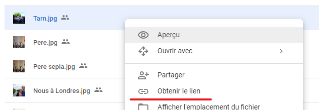

# My Portfolio

My personal portfolio.

## How to develop

This version of the website relies on [Zola](https://www.getzola.org/) for the
static site generation. To install Zola on your workstation, follow the very
detailled instructions on their website.

Once Zola is properly installed and available, you can easily serve a local
development version of the website by running the following command:

```bash
zola serve
```

The website will be available at: `http://127.0.0.1:1111` by default.

## Generating links to assets from Google Drive

To generate links to Google Drive assets, one can simply right click on the file
in Google Drive web-app, and select "Get a shareable link":



From there, paste the link in the [Google Drive Direct Link
Generator](https://buildbrothers.com/gdrive-generator/) and click "Generate
Link".